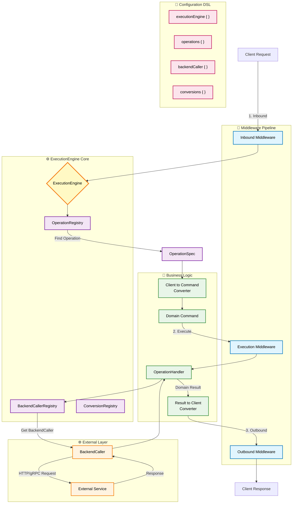

# Dekouple Architecture

## Overview

Dekouple is a modular, layer-based architecture framework for Kotlin that provides clean separation between client requests, domain logic, and backend services. The framework emphasizes type safety, middleware composition, and centralized configuration through a powerful DSL.

## Architecture Flow



## Core Components

### ExecutionEngine
The central orchestrator that manages:
- **OperationRegistry**: Maps operation IDs to their specifications
- **BackendCallerRegistry**: Manages external service callers by type
- **ConversionRegistry**: Handles message transformations between layers
- **Middleware Chains**: Processes requests through configurable middleware

### Layer Architecture

1. **Client Layer**: External API contracts (REST, GraphQL, etc.)
2. **Domain Layer**: Business logic and commands
3. **Backend Layer**: External service integrations

### Key Features

#### Centralized BackendCaller Management
```kotlin
executionEngine {
    // Configure backend callers at engine level
    backendCaller<UserServiceHost, CreateUserRequest, CreateUserResponse> {
        host = UserServiceHost.default
        endpoint = Endpoint(HttpMethod.POST, "/users")
        httpClient = myHttpClient
    }

    operations {
        operation(OpId("create-user")) {
            handler {
                CreateUserHandler(/* no BackendCaller injection needed */)
            }
        }
    }
}
```

#### Type-Safe Operation Handlers
```kotlin
class CreateUserHandler : OperationHandler<CreateUserCommand, UserCreatedResult> {
    override suspend fun handle(
        command: CreateUserCommand,
        context: ExecutionContext,
        backendCallerRegistry: BackendCallerRegistry // Injected by engine
    ): Either<Failure, UserCreatedResult> {
        val backendCaller = backendCallerRegistry.get<UserServiceHost, CreateUserRequest, CreateUserResponse>()
        // Business logic here
    }
}
```

## Project Aims

### 1. **Separation of Concerns**
- Clear boundaries between layers
- Business logic isolated from infrastructure
- External service interactions centrally managed

### 2. **Type Safety**
- Compile-time guarantees for message transformations
- Generic type preservation across layers
- Reified type support for runtime safety

### 3. **Testability**
- Easy mocking of external dependencies
- Isolated unit testing of handlers
- Configurable middleware for testing scenarios

### 4. **Flexibility**
- Hot-swappable backend configurations
- Environment-specific service endpoints
- Composable middleware chains

### 5. **Developer Experience**
- Intuitive DSL for configuration
- Minimal boilerplate code
- Clear error messages and failure handling

## Usage Patterns

### Basic Setup
```kotlin
val engine = executionEngine {
    // Configure external services
    backendCaller<PaymentHost, ProcessPaymentRequest, PaymentResponse> {
        host = PaymentHost("https://api.payments.com")
        endpoint = Endpoint(HttpMethod.POST, "/process")
        httpClient = secureHttpClient
    }

    // Define operations
    operations {
        operation(OpId("process-payment")) {
            clientToCommand { PaymentRequestConverter() }
            handler { ProcessPaymentHandler() }
            resultToClient { PaymentResponseConverter() }
        }
    }

    // Add middleware
    inboundMiddleware(AuthenticationMiddleware())
    executionMiddleware(MetricsMiddleware())
    outboundMiddleware(ResponseCacheMiddleware())
}

// Execute operations
val result = engine.execute<PaymentClientRequest, PaymentClientResponse>(
    OpId("process-payment"),
    paymentRequest
)
```

### Environment Configuration
```kotlin
val engine = executionEngine {
    backendCaller<UserServiceHost, CreateUserRequest, CreateUserResponse> {
        host = when (environment) {
            "prod" -> UserServiceHost("https://api.prod.com")
            "staging" -> UserServiceHost("https://api.staging.com")
            else -> UserServiceHost("https://api.dev.com")
        }
        endpoint = Endpoint(HttpMethod.POST, "/users")
        httpClient = configuredHttpClient
    }
}
```

## Benefits

- **Maintainability**: Clear separation makes code easier to understand and modify
- **Scalability**: Add new operations and services without affecting existing code
- **Reliability**: Type safety and centralized error handling reduce runtime issues
- **Performance**: Efficient middleware chains and connection pooling
- **Monitoring**: Built-in metrics and logging capabilities through middleware

## Migration Path

The architecture supports gradual migration:
1. Start with simple operations using the DSL
2. Extract existing handlers to use the registry pattern
3. Add middleware for cross-cutting concerns
4. Centralize backend service configurations
